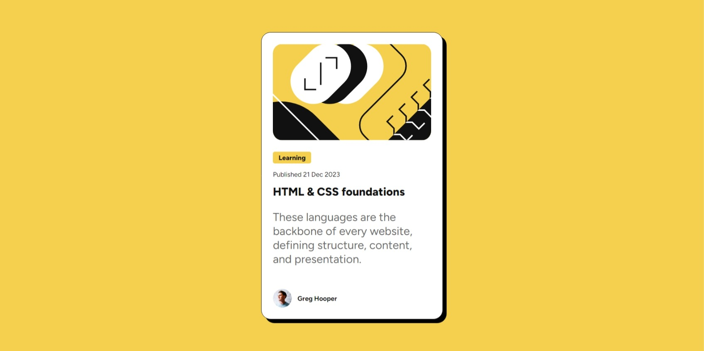
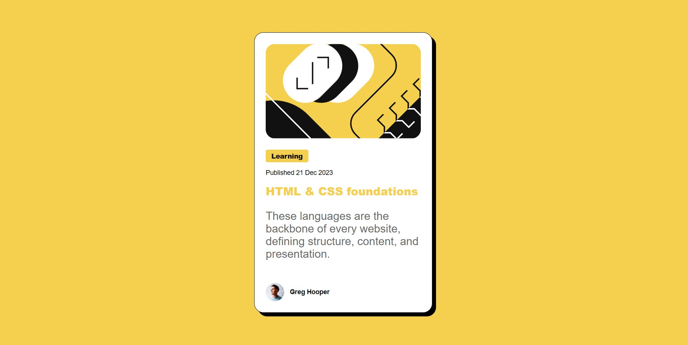

# Frontend Mentor - Blog preview card solution

This is a solution to the [Blog preview card challenge on Frontend Mentor](https://www.frontendmentor.io/challenges/blog-preview-card-ckPaj01IcS). Frontend Mentor challenges help you improve your coding skills by building realistic projects.

## Table of contents

- [Overview](#overview)
  - [The challenge](#the-challenge)
  - [Screenshot](#screenshot)
  - [Links](#links)
- [My process](#my-process)
  - [Built with](#built-with)
  - [What I learned](#what-i-learned)
  - [Continued development](#continued-development)
  - [Useful resources](#useful-resources)
- [Author](#author)
- [Acknowledgments](#acknowledgments)

**Note: Delete this note and update the table of contents based on what sections you keep.**

## Overview

### The challenge

Users should be able to:

- See hover and focus states for all interactive elements on the page

### Screenshot




### Links

- Solution URL: [Blog Preview Card - github.com](https://github.com/carlosmarte23/Blog-preview-card)
- Live Site URL: [Frontend Mentor | Blog preview card](https://carlosmarte23.github.io/Blog-preview-card/)

## My process

### Built with

- Semantic HTML5 markup
- CSS custom properties
- CSS Grid

### What I learned

Given that i struggled a little bit with CSS grid on the previous challenge, i decided to try to do this one with CSS grid. I did a bit of reasearch on how to use it and it was a bit easier than the previous challenge.

Also i learned how to do font size scaling using calc() function, which is a very useful function and in conjunction with relative units, I could complete the challenge.

```css
.card__title {
  font-size: clamp(1.25rem, 4vw, 1.5rem);
}
```

### Continued development

I'll still need to practice more with CSS grid, but i think i'm getting the hang of it. Also I'd like to start using other CSS frameworks like Bootstrap or Tailwind CSS for future projects.

### Useful resources

- [Learn CSS Grid the easy way by Kevin Powel](https://www.youtube.com/watch?v=rg7Fvvl3taU) - This video was one of the main one that I used to helpe me get the hang of CSS Grid.

- [Chat GPT](https://chatgpt.com/) - Also used this to help me with some CSS Grid properties and help me calculate the font size scaling using relative units.

## Author

- Github- [Carlos Marte](https://github.com/carlosmarte23)
- Frontend Mentor - [@carlosmarte23](https://www.frontendmentor.io/profile/carlosmarte23)
